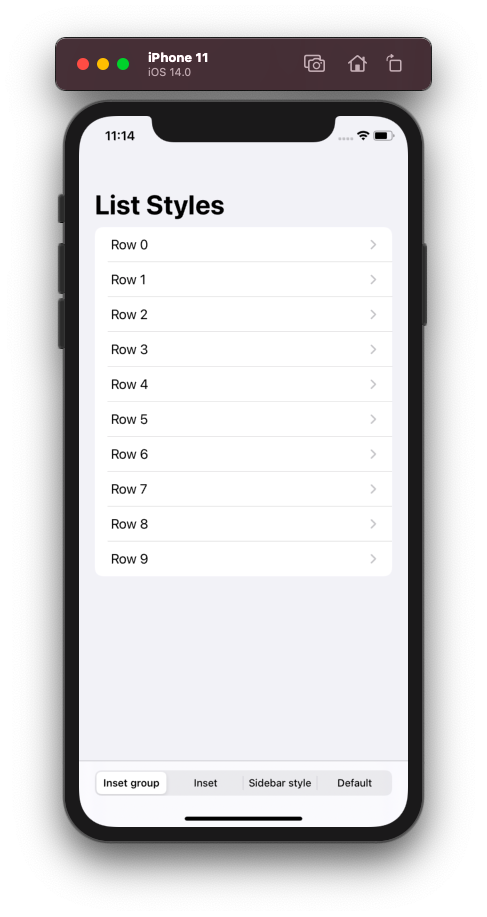
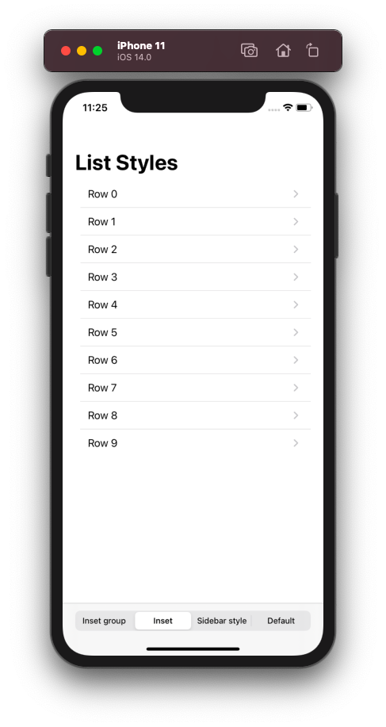
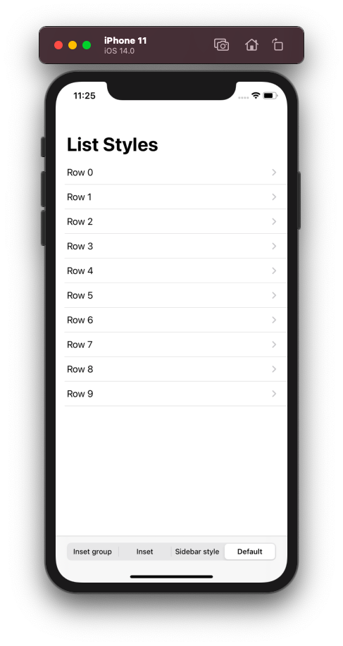
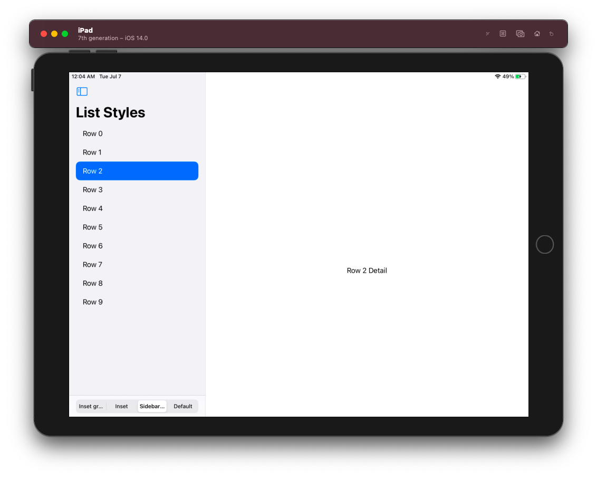
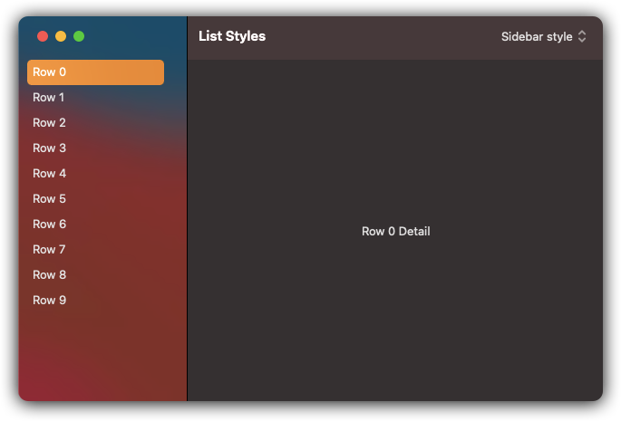

#  List Styles in SwifUI
### In this project i have tried to demonstrate diffrent type of ListStyles available in SwiftUI for **iOS**, **iPadOS** and **macOS**
</br>

> InsetGroupedListStyle
> =
> This list style was introduced new in iOS and iPadOS 14, creates and List with inset and grouped backgroud.
> [Documentation](https://developer.apple.com/documentation/swiftui/insetgroupedliststyle)

<details>
  <summary>Click to see code</summary>
  
```swift
struct ContentView: View {
    var body: some View{
        List(0..<15) { index in
            Text("Row \(index)")
        }
        .listStyle(InsetGroupedListStyle())
    }
 }
```

</details>

<p align = "center">
 
</p>

> InsetListStyle
> =
> This list style was also introduced in iOS and iPadOS 14, it creates and insetted list.
> This list style also availaible in macOS but produce same results as the default.
> Please see the image below to compare default list and inset style list
> [Documentation](https://developer.apple.com/documentation/swiftui/insetliststyle)

<details>
  <summary>Click to see code</summary>
  
```swift
struct ContentView: View {
    var body: some View{
        List(0..<15) { index in
            Text("Row \(index)")
        }
        .listStyle(InsetListStyle())
    }
 }
```
</details>

<p align = "center">

 
</p>

> SidebarListStyle
> =
> Yet another new style realeased in iOS 14 and macOS 11, this style our list to the appearence of new sidebar in macOS and iPad, This really shine when used on app of iPad and macOS it also works in iOS but only gived the inset group style look.
> [Documentation](https://developer.apple.com/documentation/swiftui/sidebarliststyle)

<details>
  <summary>Click to see code</summary>
  
```swift
struct ContentView: View {
    var body: some View{
        List(0..<15) { index in
            Text("Row \(index)")
        }
        .listStyle(SidebarListStyle())
    }
 }
```
</details>

<p align = "center">


</p>
